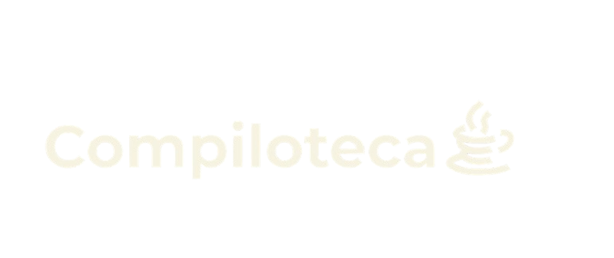

# 📚Ecommerce de Livraria

## 💻tecnologias usadas


## Proposta do Projeto

Esse é o meu projeto final do curso de PHP com MySQL que realizei no Senac em 2025, um curso curso apenas de 40 horas que me trouxe como desafio criar um ecommerce simples com tema de uma livraria digital, então eu tive a ideia de criar a Compiloteca.



## ☕Por que Compiloteca?

O nome Compiloteca veio da junção das palavras Compilar/Compiladores (termo muito utilizado no meio do T.I para rodar os programas) e biblioteca, onde minha proposta uma livraria para programadores, tendo nelas livros conhecidos como Código Limpo e O Programador Pragmático (livro que começei a ler recentemente), a fonte de texto usada é a Montserrat por ser uma fonte tradicional e bem utilizada em Ecommerces e a cor marrom foi escolhida para remeter ao café, um dos grandes companheiros dos desenvolvedores no seus momentos de reflexão( além de ser a minha cor predileta), e o bege e amarelo escolhidos pelo bom contraste com o marrom.

## Como Utilizar o Projeto?

Para você desenvolvedor que quer observa-lô de forma mais técnica e saber o que tal trecho de código faz, eu venho colocando comentários para ficar mais simples para quem ver o código

Agora para utiliza-lô você pode clona-lô colocando esse comando no seu terminal:
```bash
git clone https://github.com/seu-usuario/biblioteca_eccomerce.git
```
Eu utilizei o VsCode como IDE e o PhpMyAdmin para gerenciar o banco de dados, mas se preferir pode utilizar outros, mas para deixar o servidor PHP e MySQL ativo na sua máquina você irá precisar da ferramenta XAMPP e quando for utlizar o projeto ligar o MySQl e o Apache lá no Xampp.

A estrutura do Banco de Dados está anotada no arquivo Compiloteca.db na pasta database, mas caso você queira usar os que já estou usando precisa apenas importar o arquivo system_library.sql que está na mesma pasta, com atenção ao admin do projeto que você terá que adicionar manualmente já que por segurança eu não deixei esse dado dentro desse arquivo.

Lembre-se de trocar as informações do banco como a senha e usuário caso as suas sejam diferentes no arquivo conexao.php na pasta src.

Caso tenha dúvidas de como funciona algum trecho você pode olhar os comentários nos arquivos ou tirar dúvida comigo, podendo me chamar pelo email: Carlosbonfim722@gmail.com ou me no meu Linkedin: https://www.linkedin.com/in/carlosbonfim26/ 

# 📩Envio de email

Para o envio de email eu utilizar o PHPMailer, mas esse código não é meu, eu utilizei o código desse repositório no github: https://github.com/PHPMailer/PHPMailer/tree/master/src 

Nesse projeto por conta das rígidas regras de segurança da Google eu utilizei apenas o servidor @outlook ou @hotmail, mas você pode aprender mais sobre essa API olhando o repositório do PHPMailer

# 🔍Observações

O projeto foi feito em PHP e MySQL puro, pretendo continuar aprendendo mais tecnologias e linguagens de programação, por ser feito puramente em php ele se torna um pouco pesado e até lento, não é um dos projetos mais criativos mas eu espero que você leia e entenda um pouco da minha lógica e como eu fiz ele com o curso rolando e notável a evolução do código nos últimos commits e em determinadas partes do código, Obrigado pela visita!